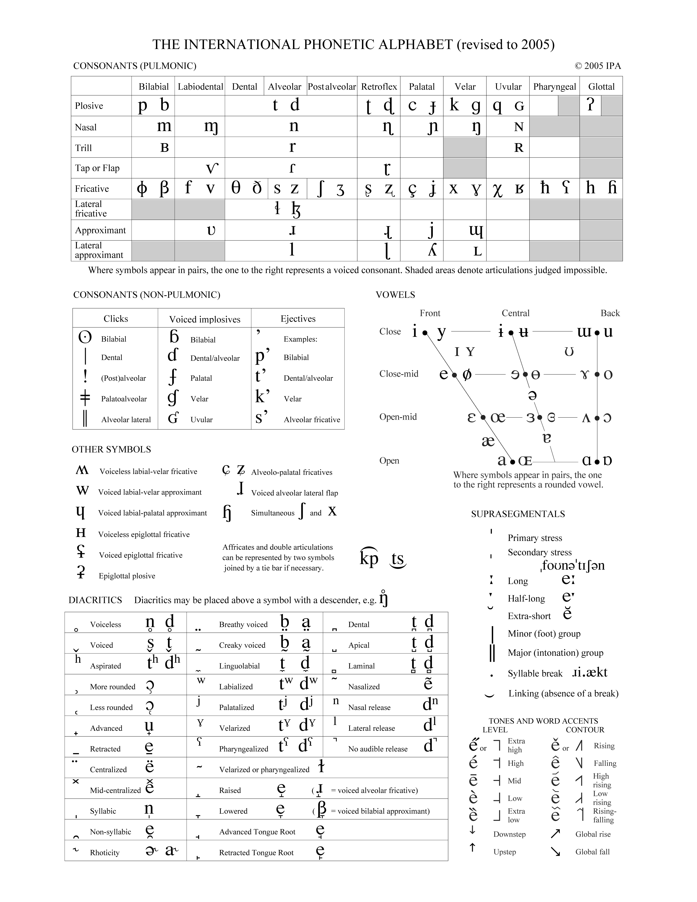

# The Internation Phonetic Alphabet

**The problem**: how to record sounds that don't exist in your language and you haven't heard before?
**The solution**: A standard. A chart which corresponds to sounds across languages such that a particular sound, regardless of the language the sound has been used in, will always be represented by a particular member of this chart. IPA is such a chart.

The IPA uses 3 attributes of a sound to assign it a particular letter:
- Place of articulation
- Manner of articulation
- (un-voiced / voiced): symbols are given in pairs

## Organization of the Phonetic chart
- Pulmonic consonants
- Non-Pulmonic consonants
- Vowels
- Other symbols
- Suprasegmentals 
- Diacritics 
- Tones and word accents

**Pulmonic sounds**: Sounds which are produced using the vocal tract and by obstructing or not obstructing the flow of air.
**Non- pulmonic**: explained later: examples include clicks. 

**unvoiced v/s voiced**: "ssss" is not voiced while "zzzz" is voiced. If you touch somewhere around the Adam's apple then a vibration will be felt in the second case.

### The columns in the IPA table

For the most part, the tongue would obstruct the sounds, till the palate, the tip of the tongue will touch the place of articulation. towards the velum and uvula, the back of the tongue is more involved. After that, the tongue isn't involved and air flow is controlled by the pharynx or the glottis.
The columns refer to the attribute: *place of articulation*:
- Bilabial: produced by the lips
- Labiodental: produced by lips and teech (probably together)
- Dental: produced in the vicinity of the teeth or by the teeth
- Alveolar: produced at the alveolar ridge
- Post-alveolar ( the part beside the alveolar ridge, marked yellow): the sound is produced in the region mentioned
- Retroflex: The tongue goes back and stretches to reach this region to produce the sound (more details to be covered)
- Palatal: produced at palate
- Velar: produced at velum
- Uvular: ..
- Pharyngeal: .. 
- Glottal: ..

The rows refer to the attribute: *manner of articulation*
The words are in three broad categories: pulmonic consonants, vowels, and non-pulmonic consonants
- Pulmonic consonants
    - Plosive: when there is a hard stop of the air flow for the sound.
    - Nasal: when the airflow is allowed to go through the nasal passage as well.
    - Trill: multiple instances of the same consonant are rolled into one.
    - Flap: the tongue touches the top part of the mouth and comes down *immediately* "ड़" in hindi as in "पहाड़"
    - Fricative: some restriction to airflow but not full restriction
    - lateral fricative
    - lateral approximant
    - Approximant
- Vowels
- Non - pulmonic consonant
    - Implosive
    - click

Top to bottom implies hard to soft: i.e. the top few rows are hard consonsonants, then we get to soft consonants, then vowels and then we get to non-pulmonic.

**Difference between alveolar and retroflex (doubt arc)**  
Retroflex is like a ballistic movement, you roll your tongue and touch the tip of it to the palate and then start the air flow and launch the tongue. So the the 't' in tomato is alveolar but the 'ट' in 'टमाटर' is retroflex.

Now, example as to how to a refer to a sound in the table:    
    + bilabial + plosive => \[p\] \[b\]  
    +  bilabial + plosive + voiced = \[b\]  
(as is visible from the above example, specifying 3 attributes gives us a specific sound)

Intresting observation:  
- "lamb" is intuitive and possible but "lanb" is problematic. The reason is that 'm' is a bilabial nasal and 'b' is a bilabial plosive: they're both bilabial and therefore it much more natural to pronounce them one after the other as opposed to the second example when 'n', a palatal nasal, is pronounced before 'b'

**Affricate sounds**: the "ch" as in "church" is an affricate sound, starts with a complete obstruction and ends with a fricative, so "ch" would be a composition of "t" followed by "sh" (IPA representation will follow) 

